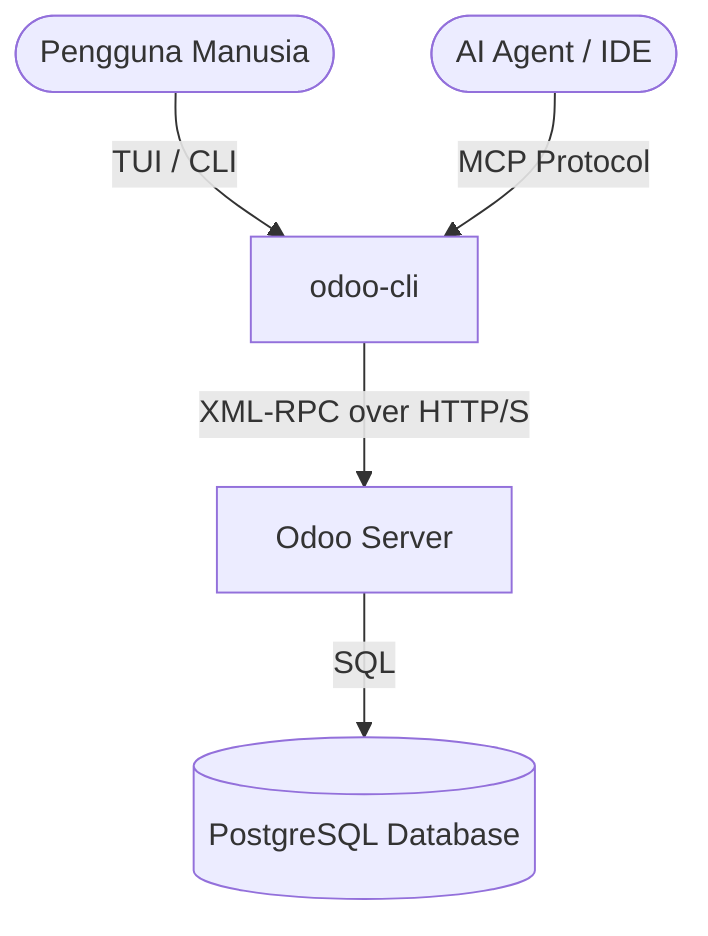
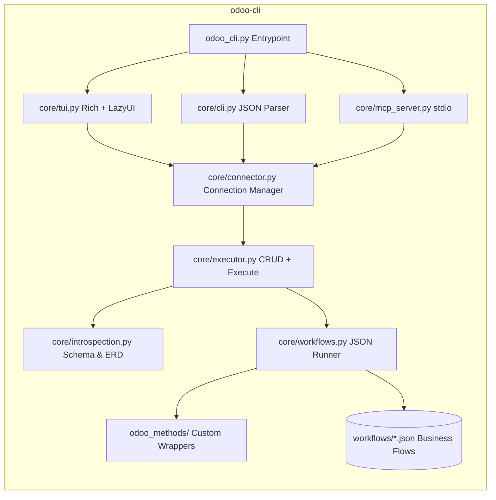

# Spesifikasi Desain: User Stories, Kontrak API, dan Diagram C4

Dokumen ini mendokumentasikan spesifikasi teknis untuk implementasi `odoo-cli` sebelum penulisan kode dimulai.

---

## 1. Diagram Arsitektur C4 (Mermaid)

### Level 1: System Context Diagram (C1)
Diagram ini menunjukkan interaksi sistem `odoo-cli` secara eksternal dengan manusia, AI Agent, dan server Odoo.



### Level 2: Container Diagram (C2)
Diagram ini memecah arsitektur internal komponen di dalam `odoo-cli`.



---

## 2. Cerita Pengguna (User Stories)

| ID | User Story | Penerimaan (Acceptance Criteria) |
|---|---|---|
| **US-01** | Sebagai admin, saya ingin mencari data menggunakan query text sederhana (misal `name:eka`) tanpa menulis sintaks domain Python Odoo agar lebih cepat mencari data. | Input string query diparse dengan benar ke format domain Notasi Polish Odoo oleh parser internal. |
| **US-02** | Sebagai integratator sistem, saya ingin pencarian data dibatasi oleh limit dan offset agar performa server Odoo tetap terjaga dan tidak terjadi kebocoran memori. | Command `search` mengembalikan hasil dengan paginasi (wajib menyertakan parameter `limit` dan `offset`). |
| **US-03** | Sebagai AI Agent, saya ingin membuat dokumen transaksi di Odoo (misal Sales Order) via instruksi MCP agar dapat mengotomatisasi pekerjaan dari asisten koding. | Aksi `create` pada MCP berhasil mengembalikan ID record baru yang dibuat di Odoo. |
| **US-04** | Sebagai pengembang, saya ingin mengekspor skema model Odoo kustom ke bentuk JSON agar dapat dijadikan referensi dokumentasi API untuk tim frontend. | Command `schema --export` menulis skema field & relasi model ke file JSON eksternal dengan rapi. |
| **US-05** | Sebagai Odoo developer, saya ingin melihat visualisasi relasi field (`many2one`, `one2many`) dari model kustom agar saya bisa memetakan ERD modul baru saya. | Fitur `schema --erd` menampilkan ringkasan relasi field antar-model dalam bentuk tabel Markdown. |
| **US-06** | Sebagai pengembang, saya ingin mengeksekusi metode internal Odoo (seperti `action_confirm`) via CLI agar bisa mensimulasikan alur tanpa masuk ke browser. | Command `execute` memanggil XML-RPC method Odoo dan mengembalikan hasil return aslinya. |
| **US-07** | Sebagai user manusia, saya ingin memilih menu utama Odoo menggunakan keyboard (arrow keys) agar navigasi data terminal terasa responsif dan interaktif. | Menu TUI dapat dieksplorasi penuh menggunakan arrow keys dan menampilkan form input interaktif `lazyui`. |
| **US-08** | Sebagai pemula Odoo, saya ingin mengakses cheatsheet cepat sintaks domain dan daftar nama model dengan menekan satu tombol di TUI agar tidak perlu mencari di Google. | Menekan tombol `?` di TUI menampilkan overlay rangkuman sintaks domain Odoo, daftar operator, dan peta nama model terpopuler. |
| **US-09** | Sebagai AI Agent, saya ingin berinteraksi secara aman dengan Odoo menggunakan API Key agar data credentials aman tanpa perlu mengekspos password utama. | Modul koneksi (`connector.py`) memvalidasi autentikasi API Key Odoo 17+ dengan sukses. |
| **US-10** | Sebagai sysadmin, saya ingin mendeteksi daftar database yang aktif pada server Odoo secara otomatis saat startup agar tidak salah memilih database. | Aksi `list_db` memanggil endpoint `/xmlrpc/2/db` dan mencetak daftar database yang terdaftar. |
| **US-11** | Sebagai Odoo Developer, saya ingin melihat jenis enkripsi password user yang tersimpan di database agar bisa memvalidasi standard keamanan sistem. | Aksi `inspect_users` (khusus admin) membaca kolom `password` dari `res.users` dan menampilkan tipenya (Bcrypt/PBKDF2) berdasarkan prefix hash. |
| **US-12** | Sebagai integrator, saya ingin menjalankan serangkaian alur bisnis (SO -> Delivery -> Invoice) lewat satu file JSON workflow agar proses integrasi berjalan konsisten. | Modul `workflows.py` mengeksekusi langkah-langkah di file JSON dan membawa variabel antar-step. |
| **US-13** | Sebagai sysadmin, saya ingin workflow dibatalkan (rollback) jika salah satu langkahnya gagal agar tidak ada data transaksi menggantung di Odoo. | Jika sebuah step gagal, runner mengeksekusi perintah di dalam blok `"on_error"` secara otomatis. |
| **US-14** | Sebagai developer, saya ingin memverifikasi struktur file JSON workflow sebelum dijalankan agar saya tahu jika ada salah ketik sintaks. | Perintah `--validate-workflow` membandingkan file JSON dengan skema JSON dan mencetak hasil validasi. |
| **US-15** | Sebagai developer, saya ingin berganti profil koneksi Odoo container secara dinamis agar bisa membandingkan data di container 1 dan container 2 dengan cepat. | Argumen `--profile <nama_profil>` meload konfigurasi koneksi yang sesuai dari `profiles.json`. |

---

## 3. Kontrak API (JSON Schema Request & Response)

Berikut adalah kontrak data yang menyelaraskan interaksi antara `executor.py` dan antarmuka pemanggil (CLI/MCP/TUI).

### A. Action: `search`
Mencari record pada model Odoo dengan paginasi dan filter.

**Request:**
```json
{
  "action": "search",
  "model": "res.partner",
  "domain": "name:Eka OR city:Bandung",
  "limit": 10,
  "offset": 0
}
```
**Response:**
```json
{
  "success": true,
  "data": [
    {
      "id": 50,
      "name": "Pak Eka",
      "city": "Bandung",
      "display_name": "Pak Eka"
    }
  ],
  "total_count": 1,
  "has_more": false
}
```

### B. Action: `create`
Membuat record baru pada model Odoo.

**Request:**
```json
{
  "action": "create",
  "model": "res.partner",
  "values": {
    "name": "Pak Eka",
    "is_company": false,
    "phone": "08123456789"
  }
}
```
**Response:**
```json
{
  "success": true,
  "id": 50,
  "message": "Record created successfully."
}
```

### C. Action: `read`
Membaca detail record berdasarkan ID.

**Request:**
```json
{
  "action": "read",
  "model": "res.partner",
  "id": 50,
  "fields": ["name", "email", "phone"]
}
```
**Response:**
```json
{
  "success": true,
  "data": {
    "id": 50,
    "name": "Pak Eka",
    "email": "eka.customer@email.com",
    "phone": "08123456789"
  }
}
```

### D. Action: `write`
Memperbarui record berdasarkan ID.

**Request:**
```json
{
  "action": "write",
  "model": "res.partner",
  "id": 50,
  "values": {
    "email": "eka.baru@email.com"
  }
}
```
**Response:**
```json
{
  "success": true,
  "id": 50,
  "message": "Record updated successfully."
}
```

### E. Action: `delete`
Menghapus (unlink) record berdasarkan ID.

**Request:**
```json
{
  "action": "delete",
  "model": "res.partner",
  "id": 50
}
```
**Response:**
```json
{
  "success": true,
  "id": 50,
  "message": "Record deleted successfully."
}
```

### F. Action: `execute`
Mengeksekusi metode khusus pada model Odoo.

**Request:**
```json
{
  "action": "execute",
  "model": "sale.order",
  "method": "action_confirm",
  "ids": [10],
  "kwargs": {}
}
```
**Response:**
```json
{
  "success": true,
  "result": true,
  "message": "Method action_confirm executed successfully."
}
```

### G. Action: `schema`
Mengambil skema field dan ERD relasi dari model Odoo.

**Request:**
```json
{
  "action": "schema",
  "model": "res.partner",
  "erd": true
}
```
**Response:**
```json
{
  "success": true,
  "model": "res.partner",
  "fields": {
    "name": {"type": "char", "string": "Name"},
    "parent_id": {
      "type": "many2one", 
      "string": "Related Company", 
      "relation": "res.partner"
    }
  },
  "relations": [
    {
      "field": "parent_id",
      "type": "many2one",
      "relation": "res.partner",
      "label": "Related Company"
    }
  ]
}
```

### H. Action: `run_workflow`
Menjalankan berkas workflow JSON bisnis.

**Request:**
```json
{
  "action": "run_workflow",
  "workflow_path": "workflows/sales_invoice.json",
  "params": {
    "customer_id": 50
  }
}
```
**Response:**
```json
{
  "success": true,
  "workflow_name": "Sales Invoice Workflow",
  "steps_executed": 3,
  "results": {
    "so_id": 11,
    "inv_id": 4
  },
  "message": "Workflow executed and verified successfully."
}
```

---

## 4. Spesifikasi Evaluasi Ekspresi & Workflow (Topik 2)

Berikut adalah aturan dan keputusan desain untuk penanganan variabel, ekspresi, dan aliran data sekuensial di dalam modul `workflows.py`:

### A. Format dan Sumber Variabel
*   **Format:** Menggunakan gaya **Jinja2 / Mustache** (kurung kurawal ganda): `{{ variabel }}`. Format ini dipilih agar terpisah dari sintaks JSON standar `{}` dan menghindari bentrokan dengan *shell scripting* `${}`.
*   **Sumber Data (Variable Scope):**
    1.  `{{ params.nama_parameter }}`: Mengakses parameter masukan dari pengguna ketika memanggil workflow.
    2.  `{{ steps.nama_langkah.field }}`: Mengakses nilai kembalian (*return values*) dari langkah sebelumnya yang telah selesai dieksekusi.
    3.  `{{ config.key }}`: Mengakses data konfigurasi profile server Odoo.

### B. Aturan Evaluasi & Keamanan (No `eval()`)
*   **Parser Aman:** Evaluasi ekspresi perbandingan dan logika wajib menggunakan parser ekspresi kustom yang aman (seperti tokenisasi sederhana atau pustaka **`simpleeval`**).
*   **Keberatan `eval()`:** Penggunaan fungsi bawaan `eval()` di Python **sangat dilarang** karena berisiko tinggi terhadap eksekusi kode arbitrer berbahaya (*arbitrary code execution*) dari parameter input eksternal.

### C. Pola Create-or-Update (Upsert)
Untuk mendukung efisiensi data, alur input mendukung aksi `create_or_update`:
```json
{
  "action": "create_or_update",
  "model": "res.partner",
  "search_domain": [["name", "=", "{{ params.name }}"]],
  "defaults": {
    "name": "{{ params.name }}",
    "phone": "{{ params.phone }}",
    "street": "{{ params.street }}"
  }
}
```
*   **Logika:**
    1.  Cari data berdasarkan `search_domain`.
    2.  Jika data ditemukan ➡️ update (`write`) field yang berubah.
    3.  Jika data tidak ditemukan ➡️ buat baru (`create`) dengan nilai default.

### D. Akses Indeks List (Array)
Gunakan indeks numerik untuk mengambil data dari list hasil pencarian langkah sebelumnya:
*   `{{ steps.cari_produk.0.id }}`: Mengambil ID record pertama.
*   `{{ steps.cari_produk.1.name }}`: Mengambil nama record kedua.

### E. Penjadwalan Fitur Percabangan (If/Else)
*   **v0.1 s.d. v0.3:** Alur eksekusi bersifat **Linear** (seluruh langkah dijalankan berurutan).
*   **v0.4+:** Ditambahkan dukungan kondisional (`condition`, `if_true`, `if_false`) setelah pondasi sistem stabil.

---

## 5. Standarisasi & Pemetaan Error Odoo (Topik 3)

Modul `core/error_mapper.py` bertanggung jawab menangkap eksepsi XML-RPC Odoo mentah dan menerjemahkannya menjadi format terstruktur yang ramah pengguna (TUI) dan dapat ditafsirkan dengan mudah oleh AI Agent (MCP).

### A. Klasifikasi Error Terjemahan

| Tipe Error Asli Odoo | Klasifikasi Internal | Contoh Pesan Ramah (User-Friendly) | Rekomendasi Tindakan (Actionable Advice) |
| :--- | :--- | :--- | :--- |
| `odoo.exceptions.AccessError` | `AccessDenied` | Akses Ditolak: Akun Anda tidak memiliki hak untuk mengakses model ini. | Periksa konfigurasi User Groups di menu Settings Odoo Anda. |
| `odoo.exceptions.ValidationError` | `ValidationError` | Gagal Validasi: Data yang dikirim melanggar batasan database Odoo. | Periksa kembali format isian (seperti email, nomor unik, atau relasi ID). |
| `odoo.exceptions.UserError` | `BusinessRuleError` | Pelanggaran Aturan Bisnis: Tindakan tidak diizinkan pada status dokumen saat ini. | Misal: Anda tidak bisa mengonfirmasi Sales Order yang belum memiliki baris produk. |
| `ConnectionRefusedError` / `Fault 404` | `ConnectionError` | Gagal Terhubung: Server Odoo tidak dapat dihubungi di port yang ditentukan. | Pastikan kontainer Odoo Docker sudah berjalan dan port mapping 8069 terbuka. |

### B. Payload Respon JSON Terstruktur

Aplikasi akan membungkus setiap error ke dalam format standard berikut:

```json
{
  "success": false,
  "error": {
    "type": "ValidationError",
    "message": "Gagal Validasi: Nama Klien wajib diisi.",
    "suggested_action": "Tambahkan parameter 'name' pada payload request Anda.",
    "raw_detail": "Fault <class 'odoo.exceptions.ValidationError'>: 'The name field is required.'"
  }
}
```

### C. Penanganan Visual TUI (Rich Panel)
Pada mode TUI, error akan dicetak menggunakan komponen `rich.panel.Panel` dengan skema warna merah menyala (`bold red`) dan menyertakan kotak saran "Rekomendasi Tindakan".

---

## 6. Fitur Keamanan AI & Log Pemulihan / Undo (Topik 6)

Untuk melindungi database Odoo (terutama pada server Production) dari kesalahan instruksi, halusinasi, atau kerusakan data massal oleh AI Agent, `odoo-cli` dilengkapi dengan sistem pengaman berlapis yang dikelola oleh modul `core/guardrails.py` dan `core/history.py`.

### A. Mekanisme Undo Log (Undo/Ctrl+Z)
1.  **Backup Sebelum Modifikasi:** Setiap kali program mendeteksi perintah manipulasi data (`write`, `delete`, `execute`), sistem melakukan pembacaan kondisi field target saat itu (`previous_state`) secara otomatis.
2.  **Penyimpanan Log Lokal:** Data lama beserta parameter pembaruan baru disimpan sebagai berkas JSON terpisah di direktori:
    `~/.cache/odoo_cli/history/txn_<timestamp>_<model>.json`
3.  **Aksi Pemulihan (Undo Command):** Pengguna dapat mengembalikan kondisi data sebelum salah eksekusi dengan perintah CLI:
    `python odoo_cli.py --undo txn_<timestamp>_<model>`

### B. Konfirmasi Manusia (Human-in-the-Loop - HITL)
1.  **Parameter Profil:** Profil koneksi Odoo dapat dikonfigurasi dengan parameter `"require_approval": true` (sangat direkomendasikan untuk database produksi).
2.  **Penangguhan Aksi (Suspended Actions):** Ketika AI memicu perubahan data via MCP, request akan tertahan dan terminal TUI/CLI manusia akan memunculkan prompt konfirmasi:
    > `[GUARD] AI meminta persetujuan UPDATE pada model 'res.partner' (ID: 52). Setujui? (y/n)`
3.  **Commit/Abort:** Aksi hanya dikirimkan ke server Odoo jika pengguna memasukkan input konfirmasi `y`.

### C. Database Branching (Kloning Docker/Postgres)
Khusus untuk Odoo yang berjalan di kontainer Docker lokal, pengembang dapat menduplikasi basis data untuk tempat uji coba aman bagi AI Agent:
*   `python odoo_cli.py db branch <db_utama> <db_uji_coba>`: Menduplikasi database Odoo via PgDump/Restore dalam hitungan detik.
*   AI melakukan eksekusi/eksperimen penuh pada `<db_uji_coba>` tanpa mengganggu data utama.
*   Pengguna dapat memeriksa secara visual di browser, lalu menyetujui sinkronisasi ke `<db_utama>`.


